# Tank Arena - Architecture Unifiée

**Tank Arena** est un jeu en Réalité Mixte où des robots autonomes affrontent des joueurs humains dans une arène projetée au sol.

> **Documentation**
> Pour les détails d'Architecture, Configuration et Dépannage, voir le [**wiki.md**](./wiki.md).

## Démarrage

### Prérequis
*   Python 3.8+
*   Pygame, OpenCV, NumPy
*   Serveur ROS Bridge (lancé pour le contrôle robot)

### Lancer le Jeu

**1. Mode Matériel Réel** (Projecteur + Caméra + Robots)
```bash
python3 main.py
```

**2. Mode Simulation** (Sans matériel)
```bash
python3 main.py --mock
```

## Structure du Projet

*   `main.py` : Point d'entrée.
*   `core/` : Logique Jeu (Manager), Contrôle (ROS), IA (Stratégie).
*   `renderer/` : Visualisation Pygame.
*   `perception/` : Vision par Ordinateur (RealSense + ArUco).
*   `config/` : Fichiers de configuration YAML.

## Notes Importantes
*   **IDs Robots** : 
    *   **ID 4** : Joueur HUMAIN (Rouge)
    *   **ID 5** : Robot IA (Bleu)
*   **Calibration** : Si la projection est décalée, lancez `scripts/run_calibration_wizard.sh`.

## Architecture du Système

Ce diagramme représente l'intégralité du flux de données et des composants du système.

```mermaid
---
config:
  theme: redux-dark
  layout: elk
  look: neo
---
flowchart TD
    %% --- HARDWARE ---
    subgraph HARDWARE ["Hardware Layer"]
        Camera["Caméra RealSense
        (Flux Vidéo)"]
        RobotPhys["Robot Physique
        (Moteurs)"]
        Projector["Projecteur
        (Affichage Sol)"]
    end

    %% --- PERCEPTION ---
    subgraph PERCEPTION ["Perception Layer"]
        RawImg["Image Brute"]
        Aruco["Détecteur ArUco
        (Opencv)"]
        RawPose["Poses Brutes (u, v)"]
        
        subgraph TRANSFORM ["UnifiedTransform Pipeline"]
            HMatrix[("Matrice H")]
            Persp["Homographie + Division w"]
            Metric["Conversion Métrique"]
        end
        
        WorldPose["Poses Monde (mètres)
        (x, y, theta)"]
    end

    %% --- WORLD MODEL ---
    subgraph WORLD ["World Model Layer"]
        Grid["Occupancy Grid
        (Grille 2D)"]
        Inflation["Inflation
        (Costmap)"]
        StaticObs[("Obstacles Statiques
        (Calibration)")]
        DynamicObs["Obstacles Dynamiques
        (Robots)"]
    end

    %% --- BRAIN (AI) ---
    subgraph BRAIN ["AI / Decision Layer"]
        Strategy["AI Strategy
        (Orchestrateur)"]
        
        subgraph BT ["Behavior Tree"]
            Selector["Selector (Root)"]
            States["États:
            - SURVIE (Flee)
            - ATTAQUE (Fire)
            - POURSUITE (Nav)"]
        end
        
        subgraph TASKS ["Task Executors"]
            FleeTask["FleeTask
            (Fuite Vectorielle)"]
            AttackTask["AttackTask
            (Alignement + Tir)"]
            NavTask["NavigationTask
            (A* + Path Following)"]
        end
        
        Decision["Décision Finale
        (Vitesse, Tir)"]
    end

    %% --- CONTROL ---
    subgraph CONTROL ["Control Layer"]
        TrajFollow["Trajectory Follower
        (Pure Pursuit)"]
        Kinematics["Kinematics Check
        (Limites v, w)"]
        Bridge["ROS Bridge Client
        (WebSocket)"]
    end

    %% --- RENDER ---
    subgraph RENDER ["Visualisation"]
        Pygame["Game Renderer
        (Pygame)"]
    end

    %% ================= CONNECTIONS =================

    %% 1. Perception Flow
    Camera --> RawImg
    RawImg --> Aruco
    Aruco --> RawPose
    RawPose --> Persp
    HMatrix -.-> Persp
    Persp --> Metric
    Metric --> WorldPose

    %% 2. World Update
    WorldPose --> DynamicObs
    StaticObs --> Grid
    DynamicObs --> Grid
    Grid --> Inflation
    Inflation -- "Costmap" --> NavTask & FleeTask

    %% 3. AI Loop
    WorldPose --> Strategy
    Strategy --> BT
    BT -- "État Actif" --> TASKS
    FleeTask --> Decision
    AttackTask --> Decision
    NavTask --> Decision

    %% 4. Control Flow
    Decision -- "Waypoints / Cible" --> TrajFollow
    TrajFollow -- "Cmd (v, w)" --> Kinematics
    Kinematics --> Bridge
    Bridge -- "JSON cmd_vel" --> RobotPhys

    %% 5. Rendering & Feedback
    WorldPose --> Pygame
    Decision --> Pygame
    Grid --> Pygame
    Pygame --> Projector

    %% Styling
    Camera:::hw
    RobotPhys:::hw
    Projector:::hw
    
    Aruco:::perc
    Persp:::perc
    Metric:::perc
    
    Grid:::world
    Inflation:::world
    
    BT:::ai
    TASKS:::ai
    Strategy:::ai
    
    TrajFollow:::ctrl
    Bridge:::ctrl

    classDef hw fill:#263238,stroke:#eceff1,color:#eceff1,rx:5,ry:5
    classDef perc fill:#e3f2fd,stroke:#1565c0,color:#0d47a1
    classDef world fill:#e8f5e9,stroke:#2e7d32,color:#1b5e20
    classDef ai fill:#f3e5f5,stroke:#7b1fa2,color:#4a148c
    classDef ctrl fill:#fff3e0,stroke:#ef6c00,color:#e65100
```


